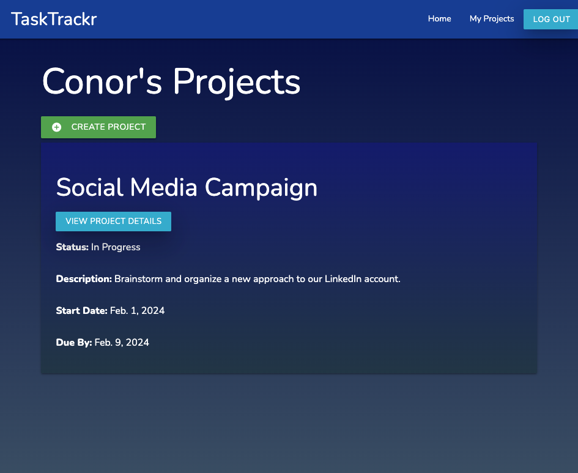
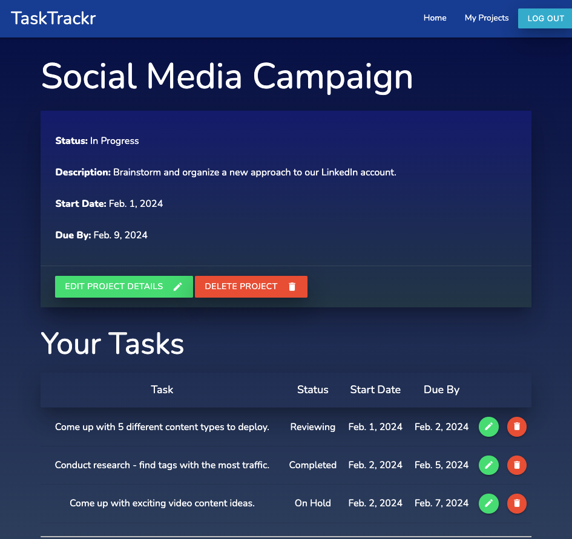

# TaskTrackr

Welcome to TaskTrackr, your go-to solution for streamlined project organization. Simply log in or sign up to access a suite of powerful tools that allow you to create, manage, and edit projects with ease. Capture project details, set crucial dates, and keep tabs on project status all in one central hub. Stay in control and stay on track with TaskTrackr.

## User Flow 

When first opening the app, users will be asked to either log in or sign up. When signing up, follow all provided instructions to create a profile. You will automatically be logged in and directed to the Projects page. 

From here, create some very basic project details. Once you've created a project, you can add individual tasks to accomplish within that project. Feel free to edit or delete any projects or tasks at any time. 

 

## Technologies Used

- Django
- Python 
- PostgreSQL
- Materialize CSS
- Heroku
- HTML / CSS
- JavaScript

## Getting Started 

To access TaskTrackr, click the link below:

TaskTrackr: https://project-management-app-6d1cc6b1809f.herokuapp.com/ 

Trello Board: https://trello.com/b/X2qFvzxt/to-do-list 

## Next Steps

Moving forward, TaskTrackr will implement several key enhancements.

- Tasks and projects will be listed in ascending order by due date, unless they are marked as complete -- as incomplete tasks and projects will be prioritized. 
- The app will apply conditional styling. For example, tasks marked as complete will be accompanied by a green background, to let users know they can move on to the next. 
- Users will be able to share a project with other users so they can collaborate.
- Google Calendar will be integrated so users can add any task due date to their own personal calendars.